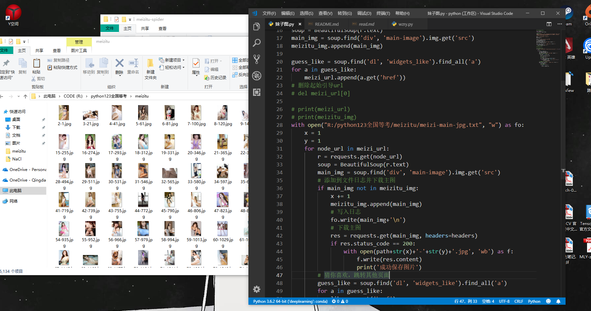
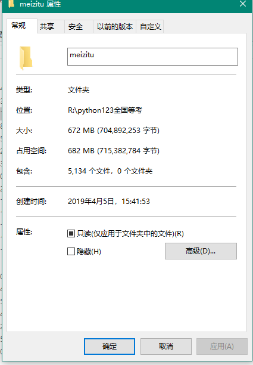
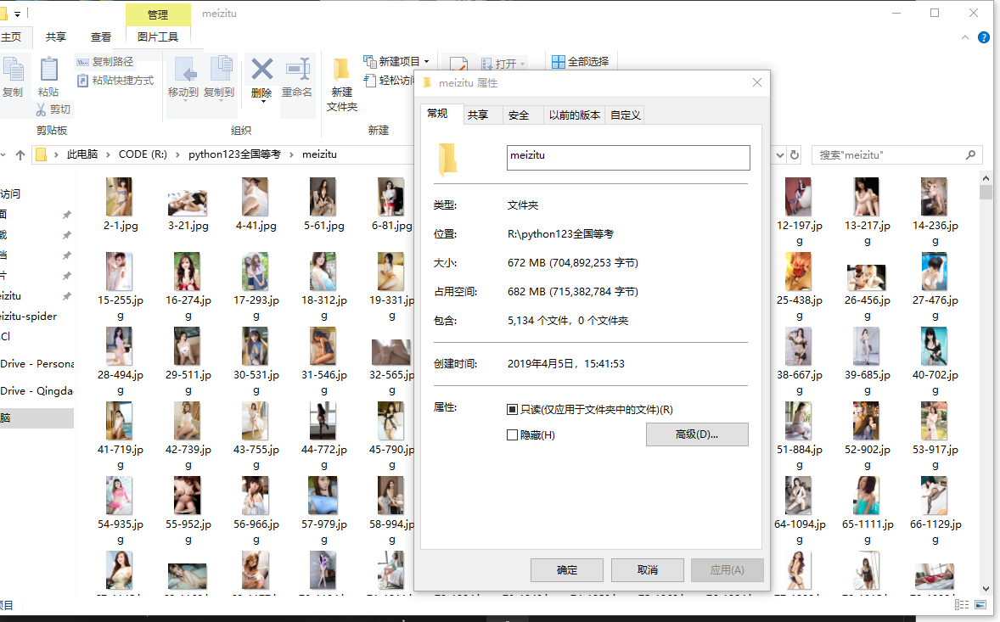
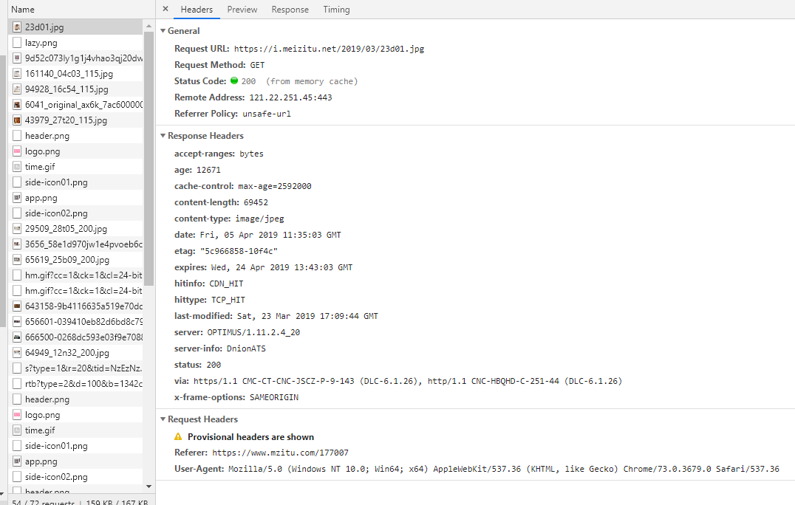

# meizitu-spider
### python通用爬虫-绕过防盗链爬取妹子图
#### 这是一只小巧方便，强大的爬虫，由python编写
#### 所需的库有
- 1. **requests**
- 2. **BeautifulSoup**
- 3. **os**
- 4. **lxml**

#### 伪装成chrome浏览器，并加上referer请求头访问服务器不会被拒绝。

### 完整项目放在GitHub：[https://github.com/Ymy214/meizitu-spider](https://github.com/Ymy214/meizitu-spider)


## 具体实现思路：
- 1. **分析网页源代码结构**
- 2. **找到合适的入口**
- 3. **循环爬取并去重加到循环队列**
- 4. **基本上实现了爬取所有图片**

## 代码思路/程序流程：
**我通过观察发现meizitu网站的分布结构虽然找不到切入口但是其结构每一个页面都会展示一个main-image主图，并且页面下面都会有*推荐*这个板块，所以就i昂到了利用从*一个页面当作入口*，利用beautifulsoup或者pyquery分析HTML页面提取出推荐的其他页面，添加到循环访问队列，整体程序最外蹭利用while循环控制结构，循环不重复地遍历队列里面的url页面，每个页面都只保存一个作为展示的主图这样就循环下去程序不停歇地运行也可以放到服务器上面爬取，顺便上传到网盘分享给广大--你懂的**

## 下面是功能以及效果展示

### 整体展示


### 爬取效果展示-丰功伟绩


### 爬取效果展示-硕果累累


### 定制请求头

### 代码展示
### python源代码如下
```python

#!/usr/bin/env python
# -*- encoding: utf-8 -*-
import requests
from bs4 import BeautifulSoup

# 定制请求头
headers = {'Referer':'https://www.mzitu.com','User-Agent':'Mozilla/5.0 (Windows NT 10.0; Win64; x64) AppleWebKit/537.36 (KHTML, like Gecko) Chrome/73.0.3679.0 Safari/537.36'}

path = 'R:/python123全国等考/meizitu/'
meizi_url = []
meizitu_img = []

start_url = 'https://www.mzitu.com/177007'
meizi_url.append(start_url)
r = requests.get(start_url)
soup = BeautifulSoup(r.text)
main_img = soup.find('div', 'main-image').img.get('src')
meizitu_img.append(main_img)

guess_like = soup.find('dl', 'widgets_like').find_all('a')
for a in guess_like:
    meizi_url.append(a.get('href'))
# 删除起始引导url
# del meizi_url[0]

# print(meizi_url)
# print(meizitu_img)
with open("R:/python123全国等考/meizitu/meizi-main-jpg.txt", "w") as fo:
    x = 1
    y = 1
    for node_url in meizi_url:
        r = requests.get(node_url)
        soup = BeautifulSoup(r.text)
        main_img = soup.find('div', 'main-image').img.get('src')
        # 添加到文件日志并下载主图
        if main_img not in meizitu_img:
            x += 1
            meizitu_img.append(main_img)
            # 写入日志
            fo.write(main_img+'\n')
            # 下载主图
            res = requests.get(main_img, headers=headers)
            if res.status_code == 200:
                with open(path+str(x)+'-'+str(y)+'.jpg', 'wb') as f:
                    f.write(res.content)
                    print('成功保存图片')  
        # 猜你喜欢，跳转其他页面
        guess_like = soup.find('dl', 'widgets_like').find_all('a')
        for a in guess_like:
            like = a.get('href')
            # 添加推荐页面
            if like not in meizi_url:
                y += 1
                meizi_url.append(like)


```

## 另外本人还有面下给小白的
- 1. **王者荣耀皮肤高清大图**
- 2. **背景故事爬虫**
### 欢迎学习支持
### 有用或帮到你的话不妨点个star我将感激不尽